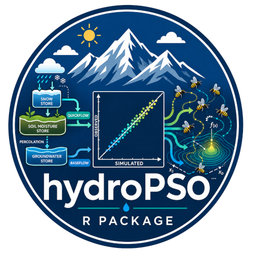
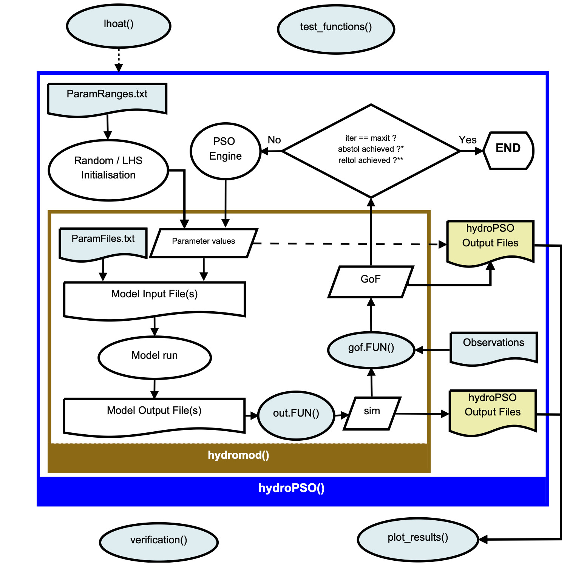

# hydroPSO: Model-independent Particle Swarm Optimisation for environmental models

[](https://doi.org/CRAN.package.hydroPSO)

[](https://www.gnu.org/licenses/old-licenses/gpl-2.0.html)
[](https://lifecycle.r-lib.org/articles/stages.html)
[](https://CRAN.R-project.org/package=hydroPSO)
[](https://hzambran.github.io/hydroPSO/)

[](https://github.com/hzambran/hydroPSO)
[](https://CRAN.R-project.org/package=hydroPSO)
[](https://github.com/hzambran/hydroPSO/actions/workflows/R-CMD-check.yaml)
[](https://cran.r-project.org/package=hydroPSO)
[](https://cran.r-project.org/package=hydroPSO)

## DESCRIPTION



**hydroPSO** is an R package for **global optimisation, parameter
calibration, and model evaluation** using advanced variants of
**Particle Swarm Optimisation (PSO)**.

It was built for scientists and practitioners working with **hydrology,
hydrometeorology, ecology, groundwater, environmental engineering, and
natural resources systems**; especially when calibration is difficult,
parameter spaces are large, and model runs are computationally
expensive.

Unlike optimisation tools tied to a single model, **hydroPSO is
model-independent**. You can connect it to:

- models written in **R**
- external models executed from the **system console**
- workflows driven by **input and output files**
- legacy simulation tools whose source code you do **not** want to
  modify

That makes hydroPSO a practical calibration engine for real-world
environmental modelling, where **reproducibility, transparency, and
flexibility** matter as much as optimisation performance.


Conceptual flowchart representing the interaction between **hydroPSO**
and the model code to be calibrated. Dashed-line boxes represent basic
I/O wrapper functions (not strictly necessary) to read/write model
files.



Flowchart describing the interaction of the main hydroPSO functions.
User-defined files **ParamRanges.txt** and **ParamFiles.txt** provide
information on the parameters to be calibrated, whereas **out.FUN()**,
**gof.FUN()**, and **observations** are used to assess the quality of
the particles positions through a user-defined Goodness-of-Fit measure.
Light-blue shaded boxes require user intervention.

## Why hydroPSO?

Environmental models are rarely easy to calibrate.

They are often **non-linear**, **non-smooth**, and **computationally
demanding**. Their parameters can interact in ways that make local
optimisation unreliable or unstable. hydroPSO was designed for exactly
that kind of problem.

## Key hydroPSO capabilities

- **State-of-the-art PSO variants**, including support for **SPSO-2011**
  and **SPSO-2007**
- **Model-independent architecture**, for both R-based and externally
  executed models
- **Parallel computing support** to reduce runtime for expensive
  calibration tasks
- **Sensitivity analysis tools** to diagnose parameter influence
- **Graphical summaries and diagnostics** to interpret optimisation
  behaviour and results
- Fine control over **PSO settings and search behaviour**
- Reproducible workflow suited to **research, teaching, and applied
  environmental modelling**

## Who is hydroPSO for?

hydroPSO is especially useful for researchers and practitioners in:

- **Hydrology**
- **Hydrometeorology**
- **Groundwater modelling**
- **Ecohydrology**
- **Catchment and watershed modelling**
- **Water resources**
- **Environmental engineering**
- **Natural resources assessment**
- Several other fields …

Typical use cases include:

- calibrating rainfall–runoff models
- tuning groundwater and solute transport models
- fitting distributed or semi-distributed environmental models
- running sensitivity and verification analyses
- comparing objective functions and calibration strategies
- building reproducible calibration workflows for publications and
  decision support

## Why model independence matters

Many environmental scientists work with legacy or third-party codes.
Rewriting those models just to enable calibration is slow, risky, and
often unrealistic.

hydroPSO avoids that bottleneck.

You can keep your model as it is and use hydroPSO as the optimisation
layer around it. The package communicates with external models through
their own input and output files, so calibration can be added without
changing the model’s internal code.

That makes hydroPSO attractive for workflows built on established tools
in hydrology, hydrometeorology, groundwater, ecology, and natural
resources modelling.

## Where hydroPSO has been used

hydroPSO has been used in studies involving models and applications such
as:

- **SWAT**
- **LISFLOOD**
- **MODFLOW / MT3DMS**
- **GR4J**
- **TUWmodel**
- groundwater transport modelling
- flood forecasting
- soil moisture and evapotranspiration studies
- eco-environmental and broader optimisation problems
- several other non-environmental and non-hydrological models

This track record makes hydroPSO relevant not only for hydrology, but
also for the wider environmental modelling community.

A **non-exhaustive list** of articles using hydroPSO is the following:

| **Year** | **Journal** | **Model(s) / Application** | **Article** |
|----|----|----|----|
| 2026 | JGR Biogeosciences | LANDIS-II / boreal permafrost, wildfire, vegetation dynamics | [Boreal futures: Projecting permafrost dynamics, wildfire, and vegetation shifts in interior Alaska](https://doi.org/10.1029/2026JG009772) |
| 2025 | Earth’s Future | OGGM / climate change impacts | [Hybrid Glacio-Hydrological Modeling Reveals Contrasting Runoff Changes in Western Patagonia Over the 21st Century](https://doi.org/10.1029/2025EF006442) |
| 2025 | Water | Sedimentation-pattern modelling | [Predictive sinusoidal modeling of sedimentation patterns: A case study of the Chimborazo Province, Ecuador](https://doi.org/10.3390/w17142109) |
| 2025 | Atmosphere | Hydrological memory conceptual model / streamflow elasticity, lag times | [Analysis of Hydrological Memory Characteristics in Taiwan’s Catchments](https://doi.org/10.3390/atmos16010019) |
| 2025 | GRL | VPM / Global terrestrial gross primary production | [Terrestrial chlorophyll limitation on global gross primary production](https://doi.org/10.1029/2025GL118340) |
| 2025 | Hydrology | MWBM / Peak-flow distributions | [Regional Analysis of the Dependence of Peak-Flow Quantiles on Climate with Application to Adjustment to Climate Trends](https://doi.org/10.3390/hydrology12050119) |
| 2024 | Sci. Data | TUWmodel / Validation of gridded meteoroligcal datasets | [PatagoniaMet: A multi-source hydrometeorological dataset for Western Patagonia](https://doi.org/10.1038/s41597-023-02828-2) |
| 2024 | Remote Sens. | SWAT / Streamflow forecasting | [Soil and Water Assessment Tool (SWAT)-Informed Deep Learning for Streamflow Forecasting with Remote Sensing and In Situ Precipitation and Discharge Observations](https://doi.org/10.3390/rs16213999) |
| 2024 | Clinica Chimica Acta | PBRTQC, RARTQC / Patient-based real-time quality control | [Exploring optimization algorithms for establishing patient-based real-time quality control models](https://doi.org/10.1016/j.cca.2024.117774) |
| 2023 | WRR | Rainfall-runoff / wildfire impacts on hydrology | [Prolonged drought in a Northern California coastal region suppresses wildfire impacts on hydrology](https://doi.org/10.1029/2022WR034206) |
| 2023 | Remote Sens. | GR4J / satellite precipitation products | [Assessment of Bottom-Up Satellite Precipitation Products on River Streamflow Estimations in the Peruvian Pacific Drainage](https://doi.org/10.3390/rs16010011) |
| 2023 | NRM | KINEROS2 / parameter allocation | [Parameter allocation approach for runoff simulation in an arid catchment by KINEROS2 hydrological model](https://doi.org/10.1111/nrm.12364) |
| 2023 | Environ. Sci. Proc. | R-UTHBAL / water balance uncertainty | [A Monthly Water Balance Model for Assessing Streamflow Uncertainty in Hydrologic Studies](https://doi.org/10.3390/ECWS-7-14192) |
| 2022 | WRR | Process models / cropland abandonment | [Exploring the Influence of Seasonal Cropland Abandonment on Irrigation Water Consumption: Case Study in the Heihe River Basin, China](https://doi.org/10.1029/2021WR031888) |
| 2022 | Remote Sens. | GR4J / satellite precipitation products | [Assessing the Performance of the Satellite-Based Precipitation Products in the Data-Sparse Himalayan Terrain](https://doi.org/10.3390/rs14194810) |
| 2022 | STOTEN | SWAT / drought-prone agroforestry | [A biophysical evaluation of a drought-prone agroforestry system in a semiarid region of Chile](https://doi.org/10.1016/j.scitotenv.2022.154608) |
| 2022 | HRL | Hydrological parameter optimisation / Chao Phraya River | [Importance of observational reliability for hydrological parameter optimization: a case study of the Upper Chao Phraya River in Thailand](https://doi.org/10.3178/hrl.16.59) |
| 2021 | ESPR | MACRO / PFOA and PFOS leaching and plant uptake | [Combined leaching and plant uptake simulations of PFOA and PFOS under field conditions](https://doi.org/10.1007/s11356-020-10594-6) |
| 2021 | HESS | TUWmodel / precipitation-product selection and parameter regionalisation | [On the selection of precipitation products for the regionalisation of hydrological model parameters](https://doi.org/10.5194/hess-25-5805-2021) |
| 2021 | JoH | SWAT / land-use and climate-change impacts | [Disentangling the effect of future land use strategies and climate change on streamflow in a Mediterranean catchment dominated by tree plantations](https://doi.org/10.1016/j.jhydrol.2021.126047) |
| 2021 | Forests | FEST-WB / forest growth and hydrology | [Integration of Forest Growth Component in the FEST-WB Hydrological Model](https://doi.org/10.3390/f12121794) |
| 2021 | JNRD | HBV-light / low-flow simulation | [Combining satellite-based rainfall data with rainfall-runoff modelling to simulate low flows in a Southern Andean catchment](https://doi.org/10.18716/ojs/jnrd/2021.11.02) |
| 2021 | NRM | Hydrological model selection / automatic calibration | [A methodological framework for the hydrological model selection process in water resource management projects](https://doi.org/10.1111/nrm.12326) |
| 2021 | EER | KINEROS2 / watershed runoff and erosion | [Parameter optimization of KINEROS2 using particle swarm optimization: A case study in Bar Watershed, Neyshabour, Iran](https://magazine.hormozgan.ac.ir/article-1-583-en.html) |
| 2020 | STOTEN | Karst recharge-discharge semi-distributed model | [Karst recharge-discharge semi distributed model to assess spatial variability of flows](https://doi.org/10.1016/j.scitotenv.2019.134368) |
| 2019 | GMD | PHREEQC-3.1.2 | [Particle swarm optimization for the estimation of surface complexation constants with the geochemical model PHREEQC-3.1.2](https://doi.org/10.5194/gmd-12-167-2019) |
| 2019 | Dev. Earth Surf. Process. | KINEROS2 | [Parameter Optimization of KINEROS2 Using Particle Swarm Optimization](https://doi.org/10.1016/B978-0-12-815226-3.00005-3) |
| 2018 | Anthropocene | WALRUS | [Hydrologic impacts of changing land use and climate in the Veneto lowlands of Italy](https://doi.org/10.1016/j.ancene.2018.04.001) |
| 2018 | JoH | Soil moisture model in R | [Can next-generation soil data products improve soil moisture modelling at the continental scale? An assessment using a new microclimate package for the R programming environment](https://doi.org/10.1016/j.jhydrol.2018.04.040) |
| 2018 | AWM | SWAT | [Assessing the impact of the MRBI program in a data limited Arkansas watershed using the SWAT model](https://doi.org/10.1016/j.agwat.2018.02.012) |
| 2018 | EMA | Air quality | [Air Quality Modeling Using the PSO-SVM-Based Approach, MLP Neural Network, and M5 Model Tree in the Metropolitan Area of Oviedo (Northern Spain)](https://doi.org/10.1007/s10666-017-9578-y) |
| 2017 | EP | WALRUS-paddy + PDP | [Hydrology and phosphorus transport simulation in a lowland polder by a coupled modeling system](https://doi.org/10.1016/j.envpol.2016.09.093) |
| 2017 | HP | SWAT | [The value of remotely sensed surface soil moisture for model calibration using SWAT](https://doi.org/10.1002/hyp.11219) |
| 2017 | IS:CLS | Genetics | [Reconstructing Genetic Regulatory Networks Using Two-Step Algorithms with the Differential Equation Models of Neural Networks](https://doi.org/10.1007/s12539-017-0254-3) |
| 2017 | Bioenergy | EPIC | [The greenhouse gas intensity and potential biofuel production capacity of maize stover harvest in the US Midwest](https://doi.org/10.1111/gcbb.12473) |
| 2017 | Sustainability | SWAT, GSWAT | [Development of an Evapotranspiration Data Assimilation Technique for Streamflow Estimates: A Case Study in a Semi-Arid Region](https://doi.org/10.3390/su9101658) |
| 2017 | CSR | Clustering colors | [Clustering colors](https://doi.org/10.1016/j.cogsys.2017.05.004) |
| 2017 | PLoS ONE | Partitioning of color space | [Does optimal partitioning of color space account for universal color categorization?](https://doi.org/10.1371/journal.pone.0178083) |
| 2017 | HESS | Isotope analysis | [Pesticide fate on catchment scale: conceptual modelling of stream CSIA data](https://doi.org/10.5194/hess-21-5243-2017) |
| 2017 | HESSD | Dissolved organic carbon | [Hydrological control of dissolved organic carbon dynamics in a rehabilitated Sphagnum-dominated peatland: a water-table based modelling approach](https://doi.org/10.5194/hess-2017-578) |
| 2016 | SC | Stock market | [Natural combination to trade in the stock market](https://doi.org/10.1007/s00500-015-1652-2) |
| 2016 | EMS | SWAT-VSA | [Coupling the short-term global forecast system weather data with a variable source area hydrologic model](https://doi.org/10.1016/j.envsoft.2016.09.008) |
| 2016 | JoH-RS | LISFLOOD | [Assessing the role of uncertain precipitation estimates on the robustness of hydrological model parameters under highly variable climate conditions](https://doi.org/10.1016/j.ejrh.2016.09.003) |
| 2016 | NHESS | LISFLOOD | [Modelling the socio-economic impact of river floods in Europe](https://doi.org/10.5194/nhess-16-1401-2016) |
| 2015 | HP | HBV | [A coupled hydrology-biogeochemistry model to simulate dissolved organic carbon exports from a permafrost-influenced catchment](https://doi.org/10.1002/hyp.10566) |
| 2015 | HESS | LISFLOOD | [Global warming increases the frequency of river floods in Europe](https://doi.org/10.5194/hess-19-2247-2015) |
| 2015 | HESS | LISFLOOD | [A pan-African medium-range ensemble flood forecast system](https://doi.org/10.5194/hess-19-3365-2015) |
| 2015 | EE | MARS-based | [Hybrid PSO-MARS-based model for forecasting a successful growth cycle of the Spirulina platensis from experimental data in open raceway ponds](https://doi.org/10.1016/j.ecoleng.2015.04.064) |
| 2015 | MJ | Malaria transmission | [Predicting the impact of border control on malaria transmission: a simulated focal screen and treat campaign](https://doi.org/10.1186/s12936-015-0776-2) |
| 2014 | JCH | MODFLOW2005-MT3DMS | [Particle Swarm Optimization for inverse modeling of solute transport in fractured gneiss aquifer](https://doi.org/10.1016/j.jconhyd.2014.06.003) |
| 2014 | JRSE | SWAT | [SWAT model parameter calibration and uncertainty analysis using the hydroPSO R package in Nzoia Basin, Kenya](https://hdl.handle.net/10568/94537) |
| 2014 | GMD | WALRUS | [The Wageningen Lowland Runoff Simulator (WALRUS): a lumped rainfall-runoff model for catchments with shallow groundwater](https://doi.org/10.5194/gmd-7-2313-2014) |
| 2014 | HESS | WALRUS | [The Wageningen Lowland Runoff Simulator (WALRUS): application to the Hupsel Brook catchment and the Cabauw polder](https://doi.org/10.5194/hess-18-4007-2014) |
| 2014 | HP | Travel-time distributions | [Consequences of mixing assumptions for time-variable travel time distributions](https://doi.org/10.1002/hyp.10372) |
| 2013 | EMS | SWAT-2005, MODFLOW-2005 | [A model-independent Particle Swarm Optimisation software for model calibration](https://doi.org/10.1016/j.envsoft.2013.01.004) |
| 2013 | IEEE | Benchmark functions | [Standard Particle Swarm Optimisation 2011 at CEC-2013: A baseline for future PSO improvements](https://doi.org/10.1109/CEC.2013.6557848) |
| 2013 | JoH | LISFLOOD | [Hydrological evaluation of satellite-based rainfall estimates over the Volta and Baro-Akobo Basin](https://doi.org/10.1016/j.jhydrol.2013.07.012) |

## Installation

### Install the development version from GitHub

``` r

if (!requireNamespace("remotes", quietly = TRUE)) {
  install.packages("remotes")
}

remotes::install_github("hzambran/hydroPSO")
```

### Archived CRAN release

hydroPSO was removed from CRAN on **2023-10-16** because it depends on
the archived packages **hydroTSM** and **hydroGOF**. Previous releases
are still available from the CRAN archive.

``` r

install.packages(
  "https://cran.r-project.org/src/contrib/Archive/hydroPSO/hydroPSO_0.5-1.tar.gz",
  repos = NULL,
  type  = "source"
)
```

> **Note** If installation fails, install archived dependencies first
> and then reinstall hydroPSO.

## Quick workflow

A typical hydroPSO workflow looks like this:

1.  **Define the parameters** to calibrate and their bounds
2.  **Run your model** from R or call an external executable
3.  **Compute an objective function** from simulated versus observed
    values
4.  **Let hydroPSO search** the parameter space
5.  **Inspect diagnostics, sensitivity, and plots**
6.  **Validate or verify** the calibrated parameter sets

At a high level, hydroPSO sits between your model and your evaluation
metric:

``` text
Parameter set -> model run -> model outputs -> objective function -> PSO update
```

## Vignettes and examples

hydroPSO includes or links to worked examples for widely used
environmental models, including:

- **GR4J**
- **TUWmodel**
- **SWAT-2005**
- **MODFLOW-2005**

These examples are useful starting points if you want to adapt hydroPSO
to your own calibration workflow.

## Citation

If you use hydroPSO in research, please cite both the software and the
main methods paper.

### Main article

> Zambrano-Bigiarini, M. and Rojas, R. (2013). **A model-independent
> Particle Swarm Optimisation software for model calibration**.
> *Environmental Modelling & Software*, 43, 5–25.
> <https://doi.org/10.1016/j.envsoft.2013.01.004>

### Package citation

> Zambrano-Bigiarini, M. and Rojas, R. (2026). **hydroPSO: Particle
> Swarm Optimisation, with Focus on Environmental Models**. R package
> version 0.6-0. <doi:10.32614/CRAN.package.hydroPSO>.
> <https://doi.org/10.32614/CRAN.package.hydroPSO>

In R:

``` r

citation("hydroPSO")
```

## Related packages

If your workflow also needs hydrological goodness-of-fit metrics or
time-series utilities, see:

- **hydroGOF** — goodness-of-fit functions for comparing simulated and
  observed hydrological series
- **hydroTSM** — time-series management, analysis, and interpolation for
  hydrological modelling

## Reporting issues and contributing

Bug reports, questions, suggestions, and collaboration are welcome.

Please use the GitHub issue tracker to:

- report bugs
- request features
- suggest documentation improvements
- share examples from your modelling workflow

## Why hydroPSO matters

hydroPSO solves a common scientific problem: how to optimise/calibrate
complex environmental models **without locking yourself into a single
model family or rewriting code you already trust**.

For hydrologists, hydrometeorologists, ecologists, groundwater
researchers, and natural resources scientists, that is not a niche
convenience. It is a practical requirement.

If your modelling workflow needs a transparent and flexible optimisation
engine, hydroPSO is a strong foundation.
