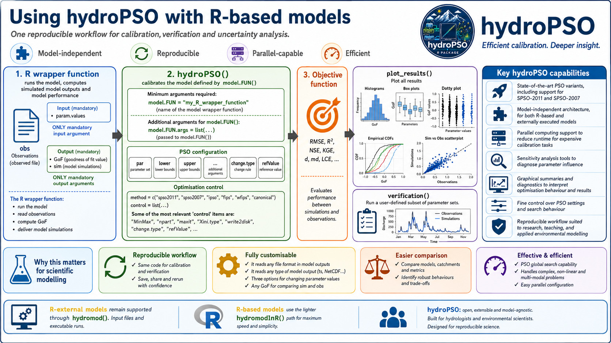

<style>
.lead {
  font-size: 1.08rem;
  color: #40515f;
  max-width: 58rem;
}
.model-grid {
  display: grid;
  grid-template-columns: repeat(auto-fit, minmax(14rem, 1fr));
  gap: 0.9rem;
  margin: 1.2rem 0 1.6rem 0;
}
.model-card {
  border: 1px solid #d8e2e8;
  border-left: 4px solid #2a9d8f;
  border-radius: 7px;
  padding: 0.9rem 1rem;
  background: #ffffff;
}
.model-card strong {
  display: block;
  color: #102033;
  margin-bottom: 0.25rem;
}
.workflow-note {
  border: 1px solid #d8e2e8;
  border-radius: 7px;
  padding: 1rem 1.1rem;
  background: #f7fafc;
  margin: 1.2rem 0;
}
</style>

# Why R-based models matter


Many hydrological and environmental models used in research are already available as **R functions**. For those models, `hydroPSO` can run the calibration directly in R, without preparing temporary input files, launching an external executable, or parsing model-output files after every particle evaluation.


This is the role of `fn = "hydromodInR"`: it keeps the PSO engine general, while letting the modeller provide the R function that turns a candidate parameter set into simulated values and a goodness-of-fit value. The same idea supports lumped conceptual models, snow-rainfall-runoff models, regional experiments, sensitivity analyses, and reproducible teaching examples.

## The basic workflow

The calibration of an **R-based model** with `hydroPSO` has a compact workflow, which is illustrated by the figure shown below:



1. **R wrapper function**: this is a user-defined function that:

 - takes a parameter set (`param.values`) as first mandatory argument
 - runs the R-based model using that parameter set,
 - reads model outputs and observations,
 - computes the model's performance.

2. **hydroPSO engine**: this is the main function of the `hydroPSO` package, which updates the parameter sets throughout the iterations. This function:

 - takes as first argument `fn="hydromodInR"`, which tells `hydroPSO` that we are going to optimise an **R-based model** (and not an external model),
 - takes the R wrapper function defined in the previous step (`model.FUN` and `model.FUN.args`),
 - takes a parameter set (`par`), coming either from the initialisation method defined by the `Xini.type` argument during the first iteration or from the PSO engine during all subsequent iterations,
 - takes the `lower` and `upper` bounds of the parameter space,
 - takes the user-defined method for changing the model parameters, by default `change.type="repl"`,
 - takes the user-defined PSO engine (by default, `method="SPSO-2011"`),
 - provides several optional ways to customise the `hydroPSO` behaviour and the delivery of model outputs,
 - uses the `hydromodInR()` function to pass the parameter set to the user-defined R wrapper function, run the model, compute model simulations, and evaluate model performance.

3. Computation of **model performance** (aka **GoF**, short for goodness-of-fit metric). The computation of model performance is carried out within the R wrapper function, using either a user-defined metric or any of the several GoFs available in the `hydroGOF` R package.

4. Several **automatically generated diagnostic figures**. When the model calibration is finished, the model is run one final time using the *best* parameter set found during the optimisation. The `plot_results` function can then be used to automatically produce more than 10 diagnostic figures (e.g., convergence plots, dotty plots, histograms, ECDFs, and simulated vs observed plots). The full set of figures can be inspected with `?plot_results`.

5. The same R wrapper function can later be reused within the `verification()` function to run a subset of the parameter sets used during the optimisation and evaluate their performance over a different temporal period.

In practice, the modeller controls the scientific aspects of the workflow: parameter meaning, model states, warm-up period, observations, transformations, objective function, and diagnostic outputs. `hydroPSO` controls the optimisation bookkeeping.

```r
out <- hydroPSO(
  fn = "hydromodInR",
  lower = lower,
  upper = upper,
  model.FUN = "run_my_model",
  model.FUN.args = list(
    inputs = InputsModel,
    run.options = RunOptions,
    obs = Qobs
  )
)
```

The model function can be as thin or as rich as needed. For example, it can call `TUWmodel`, `airGR::RunModel_GR4J()`, `airGR::RunModel_CemaNeigeGR6J()`, or a project-specific model function, then return the value that `hydroPSO` must minimise or maximise.

## Why this is useful for scientific work

<div class="model-grid">
  <div class="model-card">
    <strong>Transparent parameter mapping</strong>
    Parameters enter the model as an R object, so names, units, transformations and bounds can be checked directly in the calibration script.
  </div>
  <div class="model-card">
    <strong>Less file-system overhead</strong>
    R-based runs avoid repeated writing, copying and reading of model input and output files during every particle evaluation.
  </div>
  <div class="model-card">
    <strong>Cleaner verification</strong>
    The same wrapper used for calibration can be reused with independent periods, behavioural parameter sets, and alternative objective functions.
  </div>
  <div class="model-card">
    <strong>Comparable experiments</strong>
    Several model structures can be calibrated with the same PSO settings, objective functions and plotting tools.
  </div>
</div>

For hydrologists and environmental scientists, this makes `hydroPSO` useful as a bridge between model development and model evaluation. A prototype can be calibrated while it is still an R function, and later compared with established model structures using a common optimisation framework.

## Examples covered by the hydroPSO tutorials

The R-based tutorials use the Trancura River Basin in Chile to show the same workflow across different hydrological model structures:

- [GR4J](hydroPSO_GR4J-vignette-link.html): a parsimonious rainfall-runoff model commonly used for catchment-scale hydrology.
- [CemaNeige-GR6J](hydroPSO_GR6J_CemaNeige-vignette-link.html): a snow-aware model configuration for basins where snow accumulation and melt affect streamflow.
- [TUWmodel](hydroPSO_TUWmodel-vignette-link.html): a semi-distributed conceptual model with a larger parameter set and a different internal structure.

These examples are intentionally complementary. They show that the R-based interface is not tied to a single package or model family; it is tied to a reproducible modelling contract.

## Relationship with R-external models

R-external models remain fully supported by `hydroPSO`. They are still the right choice when the scientific model is a compiled program or a command-line tool that communicates through input and output files. In that workflow, `hydromod()` modifies files, launches the model run, reads the model output and evaluates the objective function.

R-based models use the lighter `hydromodInR()` path. The optimisation logic is the same, but the model evaluation happens directly through R function calls. This makes the R-based workflow especially attractive for exploratory research, teaching, multi-model comparison, and fast iteration on new model structures.

<div class="workflow-note">
Since hydroPSO v0.6-0, R-based models can also use `change.type = c("repl", "addi", "mult")`, with one change type for all parameters or one change type per parameter. This gives R-based and R-external models the same language for replacement, additive and multiplicative parameter updates.
</div>

## A practical rule

Use `fn = "hydromodInR"` when the model can be evaluated as an R function and the main scientific task is to explore parameter values, objective functions, calibration periods or model structures. Use the R-external workflow when the model must be driven through files and an external executable. Both paths use the same PSO engine; the difference is how a candidate parameter set is translated into one model evaluation.
