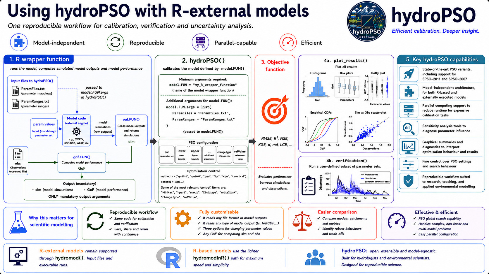

<style>
.lead {
  font-size: 1.08rem;
  color: #40515f;
  max-width: 58rem;
}
.model-grid {
  display: grid;
  grid-template-columns: repeat(auto-fit, minmax(14rem, 1fr));
  gap: 0.9rem;
  margin: 1.2rem 0 1.6rem 0;
}
.model-card {
  border: 1px solid #d8e2e8;
  border-left: 4px solid #006cb7;
  border-radius: 7px;
  padding: 0.9rem 1rem;
  background: #ffffff;
}
.model-card strong {
  display: block;
  color: #102033;
  margin-bottom: 0.25rem;
}
.workflow-note {
  border: 1px solid #d8e2e8;
  border-radius: 7px;
  padding: 1rem 1.1rem;
  background: #f7fafc;
  margin: 1.2rem 0;
}
</style>

# Why R-external models matter

<p class="lead">
Many environmental models used in science and decision support are not R functions. They are compiled executables, command-line programs, GUI-derived projects, or legacy model codes that exchange information through input and output files. `hydroPSO` was designed to calibrate that kind of model without requiring the modeller to rewrite the scientific code.
</p>

This is the role of `fn = "hydromod"`: it connects the PSO engine with an external model run. `hydroPSO` proposes parameter values, writes those values into the model input files, runs the external model, reads the simulated outputs, computes the goodness-of-fit value, and sends that value back to the swarm.



## The basic contract

An R-external calibration with `hydroPSO` has a file-based contract:

1. `ParamRanges.txt` defines the parameters to be optimised and their search ranges.
2. `ParamFiles.txt` tells `hydroPSO` where each parameter is written in the external model input files.
3. `hydromod()` modifies the model input files for the current particle.
4. The external executable is run using the command configured by the user.
5. `out.FUN()` reads the model output files and returns the simulated values.
6. `gof.FUN()` compares simulations with observations and returns the objective-function value.
7. The PSO engine uses that value to decide the next candidate parameter sets.

This contract is deliberately generic. It can support models such as SWAT+, LISFLOOD, WEAP, MODFLOW, and other domain-specific tools, as long as the model can be driven by editable inputs, a repeatable run command, and readable outputs.

```r
out <- hydroPSO(
  fn = "hydromod",
  lower = lower,
  upper = upper,
  control = list(drty.in = "PSO.in"),
  model.FUN.args = list(
    exe.fname = "run_model.sh",
    out.FUN = "read_model_output",
    out.FUN.args = list(file = "output.txt"),
    gof.FUN = "KGE",
    gof.FUN.args = list(method = "2012"),
    obs = Qobs
  )
)
```

The exact executable, input files and output reader depend on the external model. The structure of the calibration remains the same.

## Why this is useful for scientific work

<div class="model-grid">
  <div class="model-card">
    <strong>Black-box calibration</strong>
    The model can remain an external executable. The scientific code does not need to be translated into R before calibration.
  </div>
  <div class="model-card">
    <strong>Transparent file editing</strong>
    `ParamFiles.txt` records exactly where each calibrated parameter is written, making the model interface auditable and reproducible.
  </div>
  <div class="model-card">
    <strong>Model-agnostic outputs</strong>
    A custom `out.FUN()` can read text files, tables, time series or other model outputs and convert them into the simulated values needed by `gof.FUN()`.
  </div>
  <div class="model-card">
    <strong>Operational realism</strong>
    The calibrated workflow can use the same executable and project files used by agencies, consultants, observatories or modelling teams.
  </div>
</div>

For hydrologists and environmental scientists, this makes `hydroPSO` useful when the model is scientifically trusted but technically external to R. The optimisation can be scripted, repeated and inspected while preserving the existing model implementation.

## Examples and model families

The R-external workflow is useful for models and modelling systems where input files are the natural interface:

- **SWAT+ and SWAT-family models**: basin-scale simulations with many editable parameter files and spatial management inputs.
- **LISFLOOD and large-scale hydrological models**: operational or continental modelling systems where calibration often needs reproducible batch runs.
- **WEAP and planning models**: water-allocation or scenario-based tools where parameter changes may be linked to demand, infrastructure or operating rules.
- **MODFLOW and groundwater models**: numerical models where outputs may need post-processing before comparison with observations.

The package also includes a legacy tutorial reference for interfacing `hydroPSO` with SWAT-2005 and MODFLOW-2005, available through the historical hydroPSO vignette: [https://www.rforge.net/hydroPSO/files/hydroPSO_vignette.pdf](https://www.rforge.net/hydroPSO/files/hydroPSO_vignette.pdf).

## Relationship with R-based models

R-based models use `fn = "hydromodInR"` when the model can be evaluated directly as an R function. R-external models use `fn = "hydromod"` when the model is evaluated through files and an executable.

The PSO engine is shared by both workflows. The difference is the model-evaluation bridge:

- R-based models pass a parameter vector to an R function.
- R-external models write parameter values into input files, run the external model, and read output files.

This distinction lets `hydroPSO` support both research prototypes and operational modelling systems.

<div class="workflow-note">
Since hydroPSO v0.6-0, the parameter-change vocabulary `change.type = c("repl", "addi", "mult")` is shared across R-based and R-external workflows. For R-external models, this is especially useful when a parameter should be replaced, shifted relative to a baseline, or scaled from a value already present in the model input files.
</div>

## A practical rule

Use the R-external workflow when the model is a trusted executable or file-based system and the main task is to calibrate it reproducibly from R. Define clearly where parameters are written, how the model is launched, how outputs are read, and how model performance is measured. Once those four pieces are explicit, `hydroPSO` can treat the external model as a repeatable scientific experiment.
